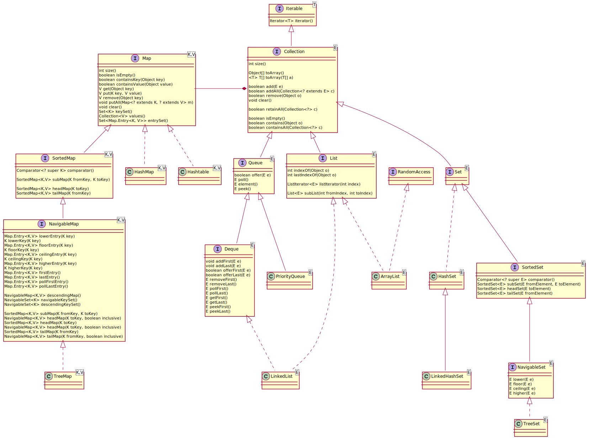

## List

## Set

## Map


 没有继承java.util.Collection接口。


## Collections

Collections 工具类常用方法:

1. 排序
2. 查找，替换操作
3. 构造不可变容器

```java
/**
 * 反转
 */
void reverse(List list)
/**
 * 随机排序
 */
void shuffle(List list)
/**
 * 按自然排序的升序排序
 */
void sort(List list)
/**
 * 定制排序，由Comparator控制排序逻辑
 */
void sort(List list, Comparator c)
/**
 * 交换两个索引位置的元素
 */
void swap(List list, int i , int j)
/**
 * 旋转
 * 当distance为正数时，将list中的后distance个元素整体移到前面；
 * 当distance为负数时，将list中的前distance个元素整体移到后面。
 */
void rotate(List list, int distance)
/**
 * 对list进行二分查找，返回索引，注意list必须是有序的
 */
int binarySearch(List list, Object key)
/**
 * 根据元素的自然顺序，返回最大的元素。 类比int min(Collection coll)
 */
int max(Collection coll)W
/**
 * 用指定的元素代替指定list中的所有元素
 */
void fill(List list, Object obj)
/**
 * 统计元素出现次数
 */
int frequency(Collection c, Object o)
/**
 * 构造空容器（类比List、Map）
 */
<T> T emptySet()
/**
 * 构造单值（只有一个元素）容器（类比Set、Map）
 */
<T> T singletonList()
/**
 * 构造不可变容器（类比Set、List）
 */
<T> T unmodifiableMap()
```
